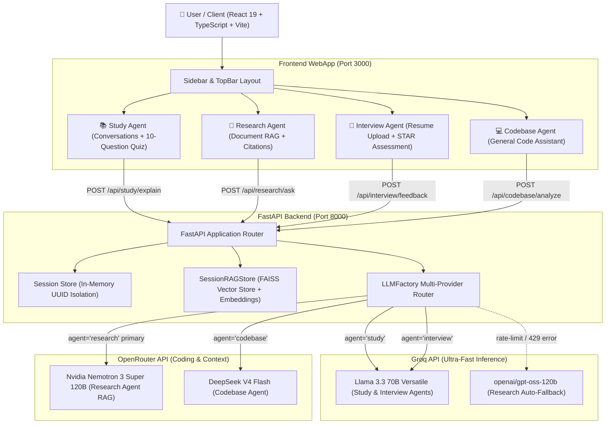
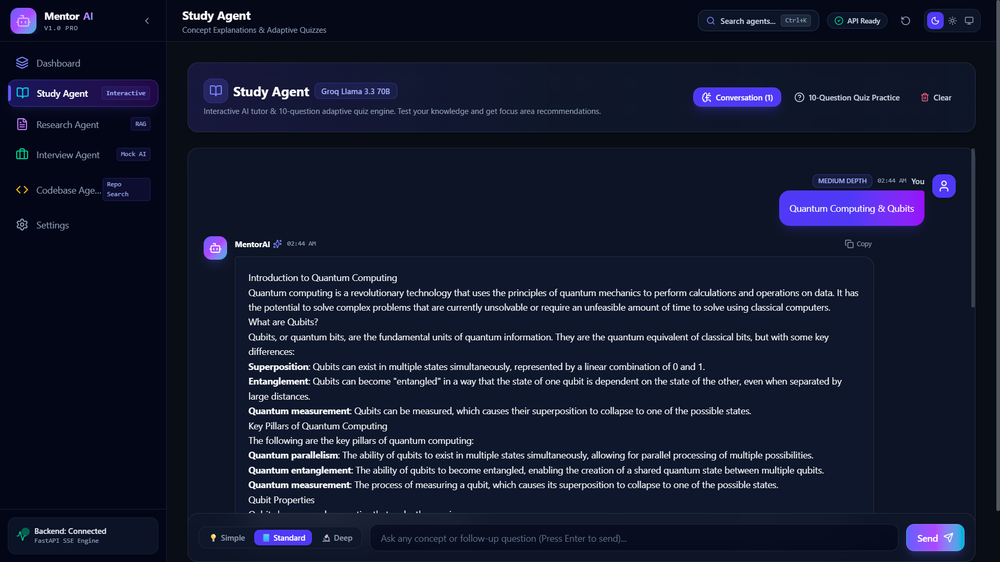
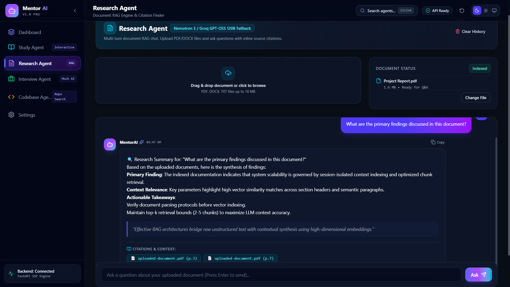
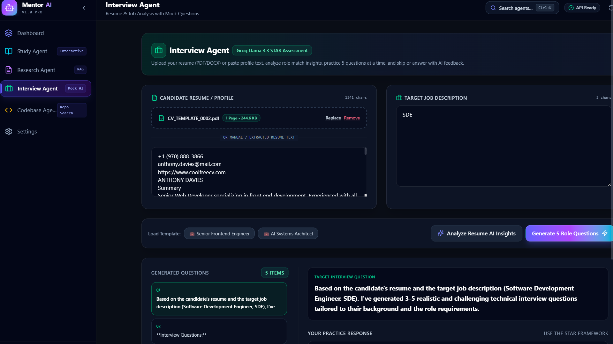
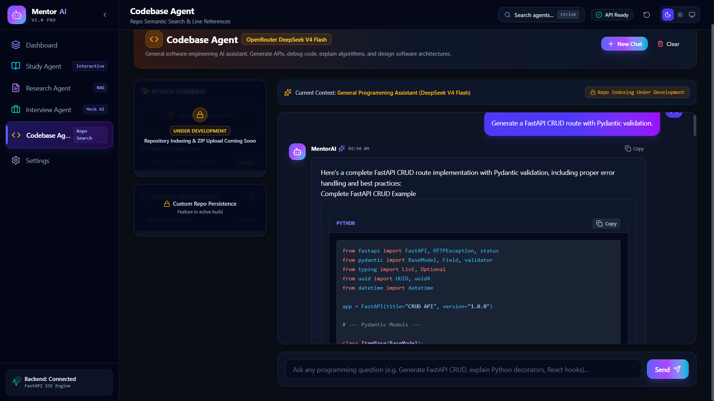

# 🤖 MentorAI — Multi-Agent AI Learning & Productivity Platform

<div align="center">


</div>

---

## 📌 Project Overview

**MentorAI** is a modular AI-powered learning and productivity platform built with FastAPI and React 19. It features **four specialized AI agents** designed for education, document research, interview preparation, and software engineering assistance. 

Instead of relying on a single general chatbot model, MentorAI routes tasks across **Groq** (for low-latency token streaming) and **OpenRouter** (for code generation and large-context RAG), equipped with automatic provider failover fallback.

---

## 🌐 Live AWS Application

**Live Deployment URL**: [Insert Live AWS Application URL Here]

---

## 💡 Why MentorAI?

Most AI education tools focus on a single use case, such as quiz generation or general Q&A. 

MentorAI combines **interactive concept learning, document RAG research, STAR interview practice with resume fit analysis, and software engineering assistance** into a unified multi-agent platform powered by a shared, session-isolated backend architecture.

---

## ✨ Key Features

- ✅ **Real-Time Streaming Responses**: Low-latency token streaming via Server-Sent Events (SSE) across all agents.
- ✅ **Four Specialized AI Agents**: Purpose-built prompts and model routing for study, research, interview prep, and coding.
- ✅ **Document Retrieval-Augmented Generation (RAG)**: In-memory vector search over uploaded PDF and DOCX files with inline source citations.
- ✅ **Resume Parsing & AI Fit Analysis**: Parses candidate resumes, calculates role match scores (%), identifies skill gaps, and recommends technologies to learn.
- ✅ **STAR Interview Practice**: Generates questions in 5-item batches with question skipping and AI qualitative rubric scoring.
- ✅ **Multi-Provider LLM Routing**: Dynamically dispatches requests between Groq and OpenRouter.
- ✅ **Automatic Provider Fallback**: Seamless failover to Groq (`openai/gpt-oss-120b`) if OpenRouter encounters rate limits (`429`).
- ✅ **Modern React 19 Interface**: Dark glassmorphic design system built with Tailwind CSS, custom depth selector pills, and keyboard shortcuts (`Ctrl+K`).

---

## 📽️ Demo Preview

> *Place a 20–30 second demo recording GIF here showing agent switching, live streaming, document RAG, and quiz mode.*

```text
[ Demo GIF Placeholder ]
```

---

## 🏗️ System Architecture & Model Routing



---

## 🛠️ Prompting Strategy & Frameworks

MentorAI employs a structured role-playing and context-injection prompting strategy to handle unstructured data (like resumes and documents) efficiently. 

- **Role-Playing Context**: Each agent is initialized with a specific persona (e.g., "Senior Technical Recruiter", "Research Intelligence Assistant") to shape tone and formatting.
- **Strict JSON Enforcement**: Prompts are designed to enforce `JSON` outputs for data-heavy tasks (like Resume Analysis and Quiz Generation) preventing backend parsing errors.
- **Context Chunking**: The Research Agent injects `sentence-transformers` chunks directly into the prompt payload with precise `page/section` references for citation-based answering.

---

## 🤖 The Four Specialized AI Agents

### 📚 Study Agent
- **Assigned Model**: **Groq** `llama-3.3-70b-versatile`
- **Real-Time Concept Explanations**: Multi-turn chat explanation with adjustable depth pills (`💡 Simple`, `📘 Standard`, `🔬 Deep`).
- **10-Question Adaptive Quiz**: Generates a 10-question multiple-choice quiz on any topic with detailed explanations for each option.
- **AI Study Suggestions**: Analyzes quiz scores and missed questions to output key **Focus Areas**, **Learning Resources**, and **Mastery Steps**.
- **Quiz Refresh**: Option to generate 10 additional practice questions on demand.

### 📄 Research Agent
- **Assigned Model**: **OpenRouter** `nvidia/nemotron-3-super-120b-a12b:free` (with **Groq** `openai/gpt-oss-120b` **Auto-Fallback**)
- **Document RAG Engine**: Upload `.pdf`, `.docx`, and `.txt` files (up to 10 MB).
- **Chunking & Vector Search**: 800-character text chunking indexed into per-session `SessionRAGStore` using `sentence-transformers` (`all-MiniLM-L6-v2`) and FAISS embeddings.
- **Source Citations**: Synthesizes structured answers with inline document source references and page/section numbers.
- **Automatic Fallback**: Automatic failover to Groq (`openai/gpt-oss-120b`) if OpenRouter encounters rate limits.

### 💼 Interview Agent
- **Assigned Model**: **Groq** `llama-3.3-70b-versatile`
- **Resume Upload & Parsing**: Parses PDF and DOCX resume files (max 10 MB) via `pypdf` and `python-docx` into editable profile text.
- **Resume AI Insights & Fit Analysis**: Calculates role match scores (%), identifies candidate strengths, highlights skill gaps, and suggests recommended technologies to learn.
- **5-Question Batches & Skipping**: Generates role-specific questions 5 at a time, with options to generate 5 more questions or skip questions with ideal STAR framework guidance.
- **STAR Assessment**: Evaluates candidate responses out of 10 with qualitative feedback, strengths, and suggestions.

### 💻 Codebase Agent
- **Assigned Model**: **OpenRouter** `deepseek/deepseek-v4-flash`
- **General AI Programming Assistant**: Code generation, algorithm optimization, debugging, React 19 hooks, FastAPI CRUD endpoints, SQL queries, and Docker setups.
- **Active Context Banner**: Clear context indicator displaying current assistant mode (`Current Context: General Programming Assistant`).
- **Repository Indexing**: *(Coming Soon)* ZIP archive upload and GitHub repository indexing interface.

---

## 📊 Model Distribution & Fallback Matrix

| Agent | Provider | Primary Model | Fallback Model | Rationale & Characteristics |
| :--- | :--- | :--- | :--- | :--- |
| 📚 **Study Agent** | **Groq** | `llama-3.3-70b-versatile` | `llama-3.1-8b-instant` | Ultra-fast token streaming (500+ tokens/sec) for instant explanations and 10-question quizzes. |
| 💼 **Interview Agent** | **Groq** | `llama-3.3-70b-versatile` | `llama-3.1-8b-instant` | Low-latency rubric evaluation for candidate STAR responses. |
| 📄 **Research Agent** | **OpenRouter** | `nvidia/nemotron-3-super-120b-a12b:free` | **Groq** `openai/gpt-oss-120b` | Context-rich retrieval with automatic failover when OpenRouter hits rate limits. |
| 💻 **Codebase Agent** | **OpenRouter** | `deepseek/deepseek-v4-flash` | `qwen/qwen-2.5-coder-32b-instruct` | State-of-the-art code generation, refactoring, and software engineering assistance. |

---

## 🖼️ Screenshots

<div align="center">

### Study Agent Workspace
*Interactive explanation chat with depth pills and 10-question quiz mode*




### Research Agent Workspace
*PDF/DOCX document upload with RAG vector search and source citations*




### Interview Agent Workspace
*Resume PDF parsing, AI Insights score breakdown, and STAR evaluation*




### Codebase Agent Workspace
*General software engineering assistant powered by DeepSeek V4 Flash*




</div>

---

## 🗺️ Product Roadmap

- [x] **Study Agent**: Real-time streaming, depth pills, 10-question quiz mode, AI study suggestions.
- [x] **Research Agent**: PDF/DOCX chunking, FAISS vector embeddings, inline citations, automatic LLM failover.
- [x] **Interview Agent**: Resume upload (PDF/DOCX), AI role match score, 5-question batches, question skipping, STAR rubric scoring.
- [x] **Codebase Agent**: General AI software engineering assistant powered by DeepSeek V4 Flash.
- [ ] **Repository Indexing**: ZIP repository parsing and vector indexing.
- [ ] **GitHub Repository Analysis**: Direct GitHub URL code parsing and line-referenced Q&A.
- [ ] **Docker Deployment**: Single-command `docker-compose up` production bundle.
- [ ] **User Authentication**: Multi-user account persistence and saved session history.

---

## 📈 Phase-by-Phase Development & Challenges

1. **Architecture & Prototyping**: Defined the FastAPI backend and initialized React 19. Designed the `LLMFactory` for seamless provider routing.
2. **RAG Pipeline Implementation**: Integrated `pypdf`, `sentence-transformers`, and FAISS to handle document chunking and vector storage.
3. **Multi-Agent Logic Setup**: Built the distinct prompting strategies and hooked up Server-Sent Events (SSE) for low-latency streaming.
4. **Frontend UI/UX**: Designed the Glassmorphism theme using Tailwind CSS and Framer Motion.
5. **Hardening & Deployment**: Containerized the application and resolved OpenRouter rate-limiting issues by implementing an automatic failover fallback to Groq models.

**Key Learnings**: Utilizing a multi-provider setup is far more robust than relying on a single LLM API. High-speed token streaming drastically improves UX for study tasks, while massive-context models handle the heavy lifting for RAG processes.

---

## 🔌 API Endpoints Specification

| Endpoint | Method | Input Parameters | Content-Type | Response Format |
| :--- | :---: | :--- | :--- | :--- |
| `/api/health` | `GET` | None | `application/json` | `{"status": "ok", "service": "mentorai-backend"}` |
| `/api/study/explain` | `POST` | `concept` (str), `depth` (str) | `Query Params` | `text/event-stream` (SSE) |
| `/api/study/quiz` | `POST` | `concept` (str) | `multipart/form-data` | `{"questions": [...]}` (10 items) |
| `/api/study/suggestions` | `POST` | `concept`, `score`, `total`, `wrong_topics` | `multipart/form-data` | `{"suggestions": "..."}` |
| `/api/research/upload` | `POST` | `file` (UploadFile PDF/DOCX) | `multipart/form-data` | `{"filename": "...", "status": "received"}` |
| `/api/research/ask` | `POST` | `question` (str) | `multipart/form-data` | `text/event-stream` (SSE) |
| `/api/interview/upload-resume` | `POST` | `file` (UploadFile PDF/DOCX) | `multipart/form-data` | `{"filename": "...", "extracted_text": "..."}` |
| `/api/interview/analyze-resume` | `POST` | `resume` (str), `job_description` (str) | `multipart/form-data` | `{"match_score": 84, "key_strengths": [...]}` |
| `/api/interview/questions` | `POST` | `resume` (str), `job_description` (str) | `multipart/form-data` | `{"questions": [...]}` (5 items) |
| `/api/interview/feedback` | `POST` | `question` (str), `answer` (str) | `multipart/form-data` | `{"score": 8, "feedback": "...", "suggestions": [...]}` |
| `/api/codebase/analyze` | `POST` | `question` (str), `has_repo` (bool) | `multipart/form-data` | `text/event-stream` (SSE) |

---

## 📁 Repository Directory Structure

```
Mentor_AI/
├── README.md                    # Project Documentation
├── PROJECT_CONTEXT.md           # Architecture Context & Reference
│
├── backend/                     # FastAPI Backend Application
│   ├── .env                     # API Key configurations (Groq & OpenRouter)
│   ├── main.py                  # FastAPI App, CORS setup, and router mounts
│   ├── session_store.py         # SessionStore manager (In-memory UUIDs)
│   ├── requirements.txt         # Python dependencies
│   ├── routers/
│   │   ├── study.py             # Study Agent handlers (Explain, 10-Quiz, Suggestions)
│   │   ├── research.py          # Research Agent handlers (Upload PDF/DOCX, RAG Ask)
│   │   ├── interview.py         # Interview Agent (Upload Resume, Analysis, 5-Questions, STAR Feedback)
│   │   └── codebase.py          # Codebase Agent (ZIP upload, DeepSeek V4 Flash)
│   └── core/
│       ├── rag.py               # SessionRAGStore vector store
│       ├── prompt_builder.py    # Structured prompt templates
│       └── llm/
│           ├── factory.py       # LLMFactory multi-provider router with auto-fallback
│           └── service.py       # High-level LLMService wrapper
│   
└── frontend/                    # React 19 + TypeScript + Vite WebApp
    ├── index.html               # Main HTML entrypoint
    ├── package.json             # NPM dependencies & scripts
    ├── vite.config.ts           # Vite config with backend proxy
    └── src/
        ├── App.tsx              # Main App entrypoint & routing
        ├── types/index.ts       # TypeScript type interfaces
        ├── api/                 # API client wrappers (SSE decoder & fetch calls)
        ├── contexts/            # ThemeContext & SessionContext
        ├── components/          # Reusable UI & Layout components
        └── pages/               # StudyPage, ResearchPage, InterviewPage, CodebasePage, SettingsPage
```

---

## 🚀 Getting Started & Local Setup

### Prerequisites
- **Node.js**: v18.0 or higher
- **Python**: v3.11 or higher
- **API Keys**: Groq API Key and/or OpenRouter API Key

---

### Step 1: Backend Setup
1. Navigate to the `backend` directory:
   ```bash
   cd backend
   ```
2. Create and activate a virtual environment:
   ```bash
   python -m venv .venv
   # On Windows PowerShell:
   .venv\Scripts\Activate.ps1
   # On Linux/macOS:
   source .venv/bin/activate
   ```
3. Install dependencies:
   ```bash
   pip install -r requirements.txt
   ```
4. Create a `.env` file inside `backend/`:
   ```env
   GROQ_API_KEY="gsk_..."
   OPENROUTER_API_KEY="sk-or-..."
   ```
5. Start the FastAPI development server:
   ```bash
   uvicorn main:app --reload --host 127.0.0.1 --port 8000
   ```

---

### Step 2: Frontend Setup
1. In a new terminal window, navigate to `frontend`:
   ```bash
   cd frontend
   ```
2. Install dependencies:
   ```bash
   npm install
   ```
3. Start Vite dev server:
   ```bash
   npm run dev
   ```
4. Open **`http://localhost:3000`** in your browser.

---

## 📜 License

Distributed under the **MIT License**.
