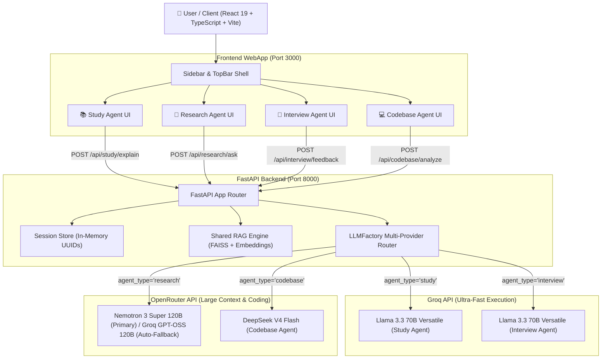

# MentorAI — Comprehensive Engineering Context & Project Documentation

## 📌 1. Project Overview & Vision

**MentorAI** is a production-quality, modular AI-powered learning and productivity platform. Unlike simple single-prompt chatbots, MentorAI operates as a full SaaS product suite (similar to *Perplexity*, *Claude*, *Notion AI*, and *GitHub Copilot*) featuring **four specialized AI agents** distributed across **Groq** (for ultra-high-speed execution) and **OpenRouter** (for massive context & deep reasoning).

**Live AWS Deployment URL**: http://13.234.66.213:3000



---

## 🛠️ 2. Technology Stack

### Backend Stack
- **Framework**: Python 3.11+ / FastAPI / Uvicorn
- **LLM Routing Engine**: `LLMFactory` ([factory.py](file:///D:/Projects/Mentor_AI/backend/core/llm/factory.py)) with OpenAI SDK clients
- **Providers & Models**:
  - ⚡ **Groq**: `llama-3.3-70b-versatile` (Study & Interview Agents)
  - 🧠 **OpenRouter**: `nvidia/nemotron-3-ultra-550b-a55b:free` (Research Document RAG)
  - 💻 **OpenRouter**: `qwen/qwen-2.5-coder-32b-instruct:free` (Codebase Agent)
- **Retrieval-Augmented Generation (RAG)**: Per-session in-memory vector index via FAISS & `sentence-transformers` (`all-MiniLM-L6-v2`)
- **Parsers**: `pypdf` (PDF), `python-docx` (Word documents), Python AST / filesystem parser (Source code)
- **Streaming**: Server-Sent Events (SSE) via `StreamingResponse`

### Frontend Stack
- **Framework**: React 19 + TypeScript + Vite
- **Styling**: Tailwind CSS with custom Glassmorphism tokens, CSS variables, and modern typography (*Inter*)
- **Icons**: Lucide React
- **Markdown & Code Syntax**: `react-markdown`, `remark-gfm`, `rehype-highlight`, `highlight.js`
- **Routing**: `react-router-dom` v7
- **State Management**: `@tanstack/react-query`, React Context (`ThemeContext`, `SessionContext`)
- **Notifications & FX**: `sonner` Toast notifications, `canvas-confetti` celebration triggers
- **Animations**: Framer Motion

---

## 🤖 3. Model Distribution Across The Four AI Agents

| Agent | Target Provider | Assigned Model | Key Rationale & Characteristics |
| :--- | :--- | :--- | :--- |
| 📚 **Study Agent** | **Groq** | `llama-3.3-70b-versatile` | Ultra-fast token streaming (300–800+ tokens/sec) for real-time concept breakdowns and instant quiz feedback. |
| 💼 **Interview Agent** | **Groq** | `llama-3.3-70b-versatile` | Low-latency structured rubric grading for STAR candidate responses against job descriptions. |
| 📄 **Research Agent** | **OpenRouter** | `nvidia/nemotron-3-ultra-550b-a55b:free` | Massive context window capable of processing long PDF/DOCX chunk retrieval without citation degradation. |
| 💻 **Codebase Agent** | **OpenRouter** | `qwen/qwen-2.5-coder-32b-instruct:free` | Purpose-built for code parsing, AST analysis, line-level code references, and syntax explanation. |

---

## 🧠 3.5 Prompting Strategy & Frameworks

MentorAI employs a dynamic, context-injected prompting strategy defined within `backend/core/prompt_builder.py`:
- **Role-Playing System Prompts**: Each agent starts with a strict persona (e.g., "Expert AI Tutor" or "Senior Technical Hiring Manager") to set the exact tone and domain constraints.
- **Strict JSON Output Enforcement**: For features like the 10-Question Quiz and Resume Analysis, the prompt explicitly demands `ONLY valid raw JSON` with a strictly defined key structure, ensuring safe parsing by the backend `LLMFactory`.
- **RAG Chunk Injection**: The Research Agent dynamically loops over FAISS-retrieved text chunks, prepending metadata like `[Source: document.pdf, Page: 2]` directly into the context window for accurate citations.

---

## 🔌 4. API Endpoints Specification

| Endpoint | Method | Input Parameters | Content-Type | Response Format |
| :--- | :---: | :--- | :--- | :--- |
| `/api/health` | `GET` | None | `application/json` | `{"status": "ok", "service": "mentorai-backend"}` |
| `/api/study/explain` | `POST` | `concept` (str), `depth` (str) | `Query Params` | `text/event-stream` (SSE): `data: {"concept": "...", "depth": "...", "message": "..."}` |
| `/api/research/upload` | `POST` | `file` (UploadFile) | `multipart/form-data` | `{"filename": "...", "content_type": "...", "status": "received", "session_id": "..."}` |
| `/api/research/ask` | `POST` | `question` (str) | `multipart/form-data` | `text/event-stream` (SSE): `data: {"answer": "...", "citations": [...]}` |
| `/api/interview/questions` | `POST` | `resume` (str), `job_description` (str) | `multipart/form-data` | `{"questions": [...], "resume_length": 120, "job_description_length": 180}` |
| `/api/interview/feedback` | `POST` | `question` (str), `answer` (str) | `multipart/form-data` | `{"score": 8, "feedback": "...", "suggestions": [...], "strengths": [...]}` |
| `/api/codebase/analyze` | `POST` | `question` (str) | `multipart/form-data` | `text/event-stream` (SSE): `data: {"answer": "...", "references": [...]}` |

---

## 🔑 5. Environment Variables Setup (`backend/.env`)

```env
GROQ_API_KEY="gsk_..."
OPENROUTER_API_KEY="sk-or-..."
```

---

## 📁 6. Repository File Directory Structure

```
Mentor_AI/
├── backend_guide.md             # Backend Engineering Specification
├── frontend_guid.md             # Frontend Engineering Specification
├── PROJECT_CONTEXT.md           # Master Project Documentation & Architecture
│
├── backend/                     # FastAPI Backend Application
│   ├── .env                     # API Key configurations (Groq & OpenRouter)
│   ├── main.py                  # FastAPI App, CORS, and Router mounts
│   ├── session_store.py         # SessionStore manager (In-memory UUIDs)
│   ├── requirements.txt         # Backend dependencies
│   ├── Dockerfile               # Production Docker container definition
│   ├── routers/
│   │   ├── study.py             # Study Agent route handlers (Groq Llama 3.3 70B)
│   │   ├── research.py          # Research Agent route handlers (OpenRouter Nemotron)
│   │   ├── interview.py         # Interview Agent route handlers (Groq Llama 3.3 70B)
│   │   └── codebase.py          # Codebase Agent route handlers (OpenRouter Qwen 2.5 Coder)
│   ├── core/
│   │   ├── embeddings.py        # Sentence-transformers embedding wrapper
│   │   ├── rag.py               # Shared SessionRAGStore (FAISS vector store)
│   │   ├── prompt_builder.py    # Structured prompt templates
│   │   └── llm/                 # Provider-agnostic LLM Layer
│   │       ├── base.py          # Abstract BaseLLMProvider interface
│   │       ├── gemini.py        # Gemini provider
│   │       ├── openrouter.py    # OpenRouter API implementation
│   │       ├── groq.py          # Groq API implementation
│   │       ├── factory.py       # LLMFactory multi-provider router
│   │       └── service.py       # High-level LLMService wrapper
│   ├── parsers/
│   │   ├── pdf_parser.py        # pypdf parser
│   │   ├── docx_parser.py       # python-docx parser
│   │   └── code_parser.py       # File system & code parser
│   └── models/
│       └── schemas.py           # Pydantic request & response schemas
│
└── frontend/                    # React 19 + TypeScript + Vite WebApp
    ├── index.html               # Main HTML entrypoint with Inter font & SEO tags
    ├── package.json             # NPM dependencies & scripts
    ├── vite.config.ts           # Vite config with Tailwind plugin & backend proxy
    ├── tsconfig.app.json        # TypeScript configuration & path aliases (@/*)
    └── src/
        ├── main.tsx             # React DOM root entrypoint
        ├── App.tsx              # React Router setup & global providers
        ├── index.css            # Master TailwindCSS & Glassmorphism styles
        ├── types/
        │   └── index.ts         # TypeScript models for sessions, agents, and responses
        ├── api/
        │   ├── client.ts        # Fetch wrapper, SSE stream decoder, and session token manager
        │   ├── studyApi.ts      # Study Agent API integration
        │   ├── researchApi.ts   # Research Agent API integration
        │   ├── interviewApi.ts  # Interview Agent API integration
        │   └── codebaseApi.ts   # Codebase Agent API integration
        ├── contexts/
        │   ├── ThemeContext.tsx # Dark / Light / System theme state manager
        │   └── SessionContext.tsx # Backend health monitor & session manager
        ├── components/
        │   ├── ui/              # Reusable UI component library
        │   └── layout/          # Sidebar, TopBar, & MainLayout
        └── pages/               # Agent workspaces & Settings
```

---

## 🚀 7. Quick Start & Execution Guide

### Backend Setup
```bash
cd backend
python -m venv .venv
.venv\Scripts\Activate.ps1   # (On Windows)
pip install -r requirements.txt

# Launch FastAPI Server
uvicorn main:app --reload --host 127.0.0.1 --port 8000
```

### Frontend Setup
```bash
cd frontend
npm install
npm run dev
```
Open your browser at `http://localhost:3000`.

---

## 📈 8. Phase-by-Phase Development & Challenges

1. **Phase 1 (Architecture)**: Designed the FastAPI backend shell, built the React 19 UI foundations, and mapped out the multi-provider LLM strategy (Groq + OpenRouter).
2. **Phase 2 (RAG & Parsers)**: Implemented `pypdf`, `python-docx`, and FAISS to enable robust document ingestion and vector retrieval.
3. **Phase 3 (Prompting & Agent Logic)**: Engineered the distinct persona prompts for all four agents. Hooked up Server-Sent Events (SSE) across the backend to stream responses to the frontend.
4. **Phase 4 (UI/UX Refinement)**: Finalized the Glassmorphism Tailwind theme, added context banners, interactive depth pills, and JSON-based rubric evaluation visualizers.
5. **Phase 5 (Deployment & Resilience)**: Deployed to AWS EC2 via Docker. Addressed OpenRouter API rate limit errors by engineering an automatic failover fallback to Groq (`openai/gpt-oss-120b`).

**Key Learnings**: We discovered that relying on a single LLM API limits UX. Groq provides essential speed for immediate chat feedback (Study Agent), whereas OpenRouter provides the context size necessary for complex RAG tasks (Research Agent). Building a resilient fallback layer in `LLMFactory` was crucial for uptime.
