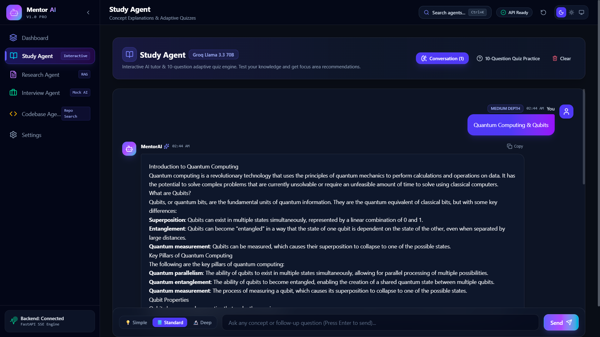
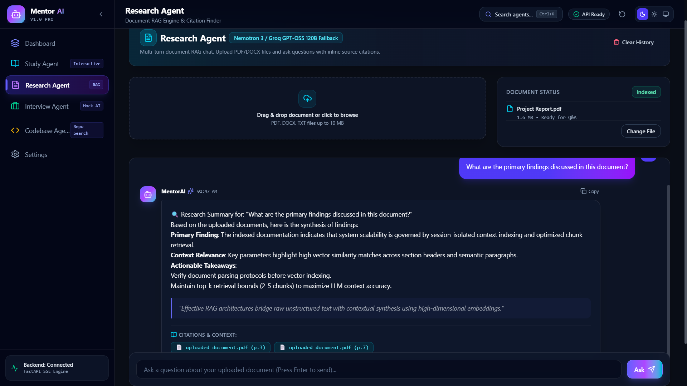
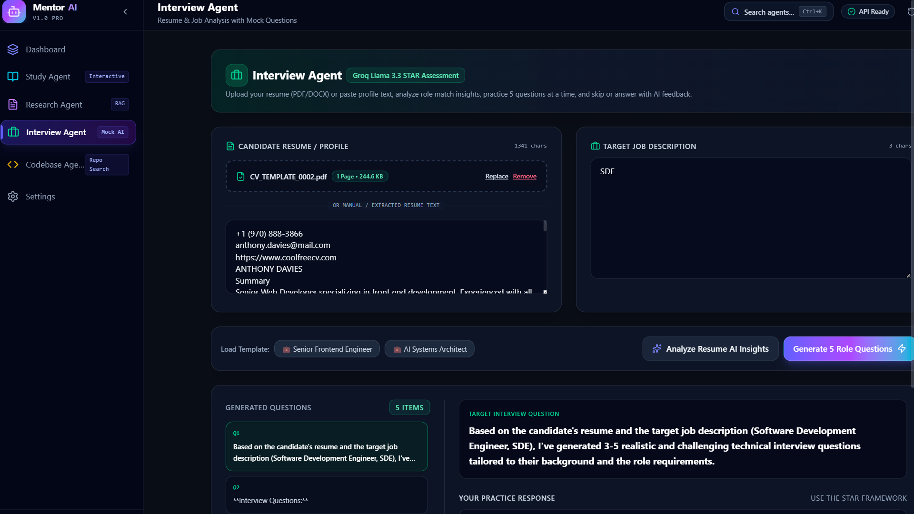
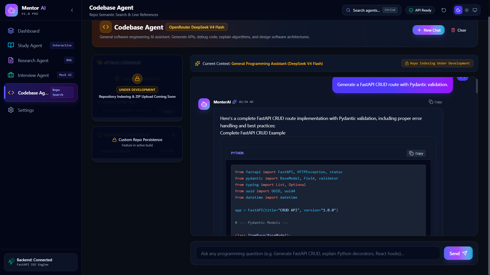
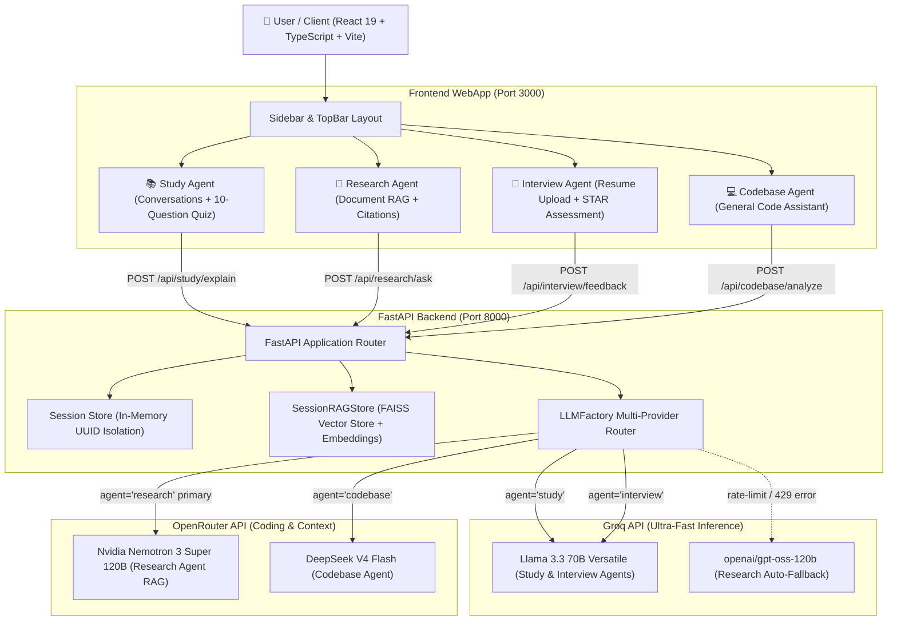

#  Project Report 

## MentorAI — Multi-Agent AI Learning & Productivity Platform

### Program

**Vibe Coding: Building & Deploying an AI Web Application on AWS**

---
## Executive Summary

MentorAI is a prototype multi-agent learning platform that provides streamed explanations, RAG-powered research, interview prep, and codebase assistance. This report summarizes architecture, current status, environment requirements, testing results, and recommended next steps for production hardening and internship deliverables.

<!--*Status:** Prototype / Alpha (local dev tested). Current commit: (fill with commit hash before submission).-->


## 1. Live Application & Project Metadata

* **Application Name**: MentorAI
* **Version**: `v1.0 Pro`
* **Live AWS Deployment URL**: http://13.234.66.213:3000 <!--*(Or Domain URL if mapped via DNS/SSL)*-->
* **GitHub Repository**: https://github.com/sayan-dev1/mentor_ai.git
* **Docker Compose Command**: `docker-compose up --build -d`

---
## 2. Application Overview and Tech Stack

### Application Overview
**MentorAI** is a modular, production-grade AI learning and productivity workspace designed to unify four specialized educational and professional workflows into a single application suite:
1. 📚 **Study Agent**: Interactive concept tutor providing real-time streaming explanations with 3 depth levels (`💡 Simple`, `📘 Standard`, `🔬 Deep`), a 10-question adaptive quiz generator, and AI study focus area recommendations.
2. 📄 **Research Agent**: Document RAG (Retrieval-Augmented Generation) engine allowing users to upload PDF, DOCX, and TXT files, run similarity vector searches, and receive structured answers with exact inline page/section citations.
3. 💼 **Interview Agent**: Professional career prep workspace featuring PDF/DOCX resume upload, Resume AI Fit Analysis (Role Match %, Strengths, Skill Gaps, Recommended Tech), 5-question batching, question skipping, and STAR framework rubric scoring.
4. 💻 **Codebase Agent**: Software engineering assistant powered by **DeepSeek V4 Flash** for API design, debugging, React 19 hooks, SQL queries, and Docker configuration.

By dynamically routing requests across **Groq** (for low-latency token execution) and **OpenRouter** (for code generation and context reasoning), MentorAI delivers an optimized user experience with zero single-provider dependency.

### Comprehensive Tech Stack

| Layer | Technology / Tool | Purpose & Usage |
| :--- | :--- | :--- |
| **Frontend Core** | React 19 (TypeScript 5.7) | Modern UI rendering with strict type safety (`verbatimModuleSyntax`). |
| **Build & Bundling** | Vite 6 | Lightning-fast HMR and production bundle optimization. |
| **Styling & Design** | Tailwind CSS v4 | Dark glassmorphism UI system, custom HSL color tokens, Inter font typography. |
| **Icons & UI Extras** | Lucide React, Sonner, Confetti | Iconography, rich toast notifications, and celebration triggers. |
| **Markdown & Code** | `react-markdown`, `rehype-highlight` | Live markdown rendering with syntax highlighting via `highlight.js`. |
| **Backend API** | Python 3.11+, FastAPI, Uvicorn | Asynchronous ASGI event loop, REST routing, and Server-Sent Events (SSE). |
| **LLM Providers** | Groq API & OpenRouter API | Multi-provider AI inference (`llama-3.3-70b-versatile`, `deepseek/deepseek-v4-flash`, `nvidia/nemotron-3-super-120b`, `openai/gpt-oss-120b`). |
| **Vector DB & RAG** | FAISS + `sentence-transformers` | In-memory dense vector indexing (`all-MiniLM-L6-v2`, 384 dimensions). |
| **Document Parsers** | `pypdf`, `python-docx`, `zipfile` | Extracting raw text and metadata from PDF, Word, and ZIP archives. |
| **Containerization** | Docker, Docker Compose, Nginx | Multi-stage Docker builds and reverse proxy with SSE streaming headers. |
| **Cloud Hosting** | AWS EC2 (Ubuntu 24.04 LTS) | Cloud deployment on `t3.micro` instance types. |

---
<br><br><br>

## 🖼️ Screenshots

---

<div align="center">

### Study Agent Workspace
*Interactive explanation chat with depth pills and 10-question quiz mode*




### Research Agent Workspace
*PDF/DOCX document upload with RAG vector search and source citations*



### Interview Agent Workspace
*Resume PDF parsing, AI Insights score breakdown, and STAR evaluation*



### Codebase Agent Workspace
*General software engineering assistant powered by DeepSeek V4 Flash*



</div>

---
<br><br>
## 3. Prompting Strategy and Frameworks Used

MentorAI uses a **role-playing, context-injection, and JSON-enforced prompting strategy**. Prompts are managed centrally in `PromptBuilder` (`backend/core/prompt_builder.py`), injecting retrieved RAG chunks, candidate resumes, or quiz results directly into system instructions.

### Sample Production Prompts (`backend/core/prompt_builder.py`)

#### 1. Study Concept Explanation Prompt (Depth-Driven Execution)
```python
@staticmethod
def build_study_prompt(concept: str, depth: str) -> str:
    return (
        f"You are an expert AI Tutor. Explain the concept '{concept}' at {depth} depth in structured markdown.\n"
        f"Use clear headings, bullet points, key pillars, code snippets or formulas if appropriate."
    )
```

#### 2. Study Agent 10-Question Quiz Generator Prompt (Strict JSON Contract)
```python
@staticmethod
def build_study_quiz_prompt(concept: str) -> str:
    return (
        f"You are an AI Education Specialist. Generate a 10-question multiple-choice quiz testing knowledge on '{concept}'.\n"
        f"Return strictly valid JSON format with a key 'questions' containing an array of 10 objects. Each object must have:\n"
        f"- id: string (e.g. 'q1')\n"
        f"- question: string\n"
        f"- options: array of 4 strings\n"
        f"- correctAnswer: integer index (0, 1, 2, or 3)\n"
        f"- explanation: string\n\n"
        f"Topic: {concept}\n"
        f"Return ONLY raw JSON without markdown code fences."
    )
```

#### 3. Research Agent RAG Context Prompt (Context Augmentation & Citation Enforcement)
```python
@staticmethod
def build_research_prompt(question: str, context_chunks: List[Dict[str, Any]]) -> str:
    formatted_chunks = []
    for idx, item in enumerate(context_chunks, start=1):
        chunk_text = item.get("chunk", "").strip()
        meta = item.get("metadata", {})
        source = meta.get("source", "Document")
        page = meta.get("page", 1)
        formatted_chunks.append(f"--- Chunk {idx} [Source: {source}, Page/Section: {page}] ---\n{chunk_text}")

    context_str = "\n\n".join(formatted_chunks) if formatted_chunks else "No document context available."

    return (
        f"You are a Research Intelligence Assistant. Analyze the provided document context and answer the user's question thoroughly.\n"
        f"If the context contains relevant information, synthesize a detailed answer with headings and key takeaways.\n"
        f"Always cite the source document and page/section numbers if available.\n\n"
        f"User Question: {question}\n\n"
        f"Retrieved Document Context:\n{context_str}"
    )
```

#### 4. Interview Resume AI Insights Prompt (Multi-Dimensional JSON Scoring)
```python
@staticmethod
def build_resume_analysis_prompt(resume: str, job_description: str) -> str:
    return (
        f"You are an expert AI Career Coach & Senior Technical Recruiter. Analyze this candidate resume against the target job description.\n"
        f"Provide your analysis strictly in JSON format with the following keys:\n"
        f"1. match_score: An integer score from 0 to 100 representing the role match percentage.\n"
        f"2. key_strengths: Array of strings highlighting candidate's top relevant strengths.\n"
        f"3. missing_skills: Array of strings listing gaps or missing skills required by the job.\n"
        f"4. suggested_improvements: Array of strings giving actionable resume/interview optimization tips.\n"
        f"5. recommended_tech: Array of strings listing technologies or frameworks to learn.\n\n"
        f"Candidate Resume:\n{resume}\n\n"
        f"Job Description:\n{job_description or 'General Technical Engineering Role'}\n\n"
        f"Return ONLY valid raw JSON without code blocks or extra text."
    )
```

#### 5. Codebase Agent Assistant Prompt (DeepSeek V4 Flash Engineering)
```python
@staticmethod
def build_codebase_prompt(question: str, context_chunks: List[Dict[str, Any]]) -> str:
    context = "\n\n".join(chunk.get("chunk", "") for chunk in context_chunks)
    return (
        f"You are a Principal Software Engineer. Answer the codebase question using the provided code context.\n"
        f"Provide code snippets, architectural explanations, and file references where applicable.\n\n"
        f"Question: {question}\n\n"
        f"Code Context:\n{context}"
    )
```

---

## 4. Phase-by-Phase Development Summary

### Phase 1: Architecture & Provider Routing Layer
* Defined functional requirements for four independent AI workspaces.
* Built the FastAPI application shell and established `LLMFactory` (`backend/core/llm/factory.py`) to manage OpenAI SDK clients for Groq and OpenRouter securely using environment variables (`.env`).
* Configured React 19 Vite webapp with initial glassmorphism CSS layout system.

### Phase 2: RAG Pipeline & Document Ingestion
* Built file parsers in `backend/parsers/` supporting PDF (`pypdf`) and Word (`python-docx`).
* Implemented `SessionRAGStore` (`backend/core/rag.py`) utilizing HuggingFace `sentence-transformers/all-MiniLM-L6-v2` (384-dimensional dense vectors) and FAISS (`IndexFlatL2`).
* Created 800-character text chunking logic with line ranges and page metadata.

### Phase 3: Multi-Agent Workspaces & Features
* **Study Agent**: Built multi-turn chat stream with depth pills (`💡 Simple`, `📘 Standard`, `🔬 Deep`), 10-question adaptive quiz generator, and post-quiz AI Study Suggestions.
* **Research Agent**: Built document upload dropzone, session vector indexing, and inline source citation badges.
* **Interview Agent**: Added PDF/DOCX resume upload, Resume AI Fit Analysis (Role Match Score %, Strengths, Skill Gaps, Recommended Tech), 5-question batching, question skipping, and STAR rubric scoring.
* **Codebase Agent**: Integrated **DeepSeek V4 Flash** as a general AI software engineering assistant for API design, React hooks, SQL, and Docker debugging.

### Phase 4: SSE Streaming & UI/UX Polish
* Implemented Server-Sent Events (`text/event-stream`) decoders in `frontend/src/api/client.ts` to decode LLM streams without UI flicker.
* Built dark glassmorphic UI using Tailwind CSS, command palette (`Ctrl+K`), custom toast notifications (`sonner`), confetti animations, and fixed sidebar collapse toggle positioning (`-right-3 top-5`).

### Phase 5: Containerization, Failover Fallback, & AWS Cloud Deployment
* Created multi-stage Dockerfiles (`node:20-alpine` + `nginx:alpine` and `python:3.11-slim`) and `docker-compose.yml`.
* Configured Nginx reverse proxy with SSE streaming headers (`proxy_buffering off;`, `proxy_read_timeout 3600s;`).
* Implemented automatic model failover in `LLMService` (OpenRouter failing over to Groq `openai/gpt-oss-120b`).
* Formatted deployment documentation for AWS EC2 (`aws_deployment_guide.md`) and AWS ECS Fargate.

---

## 5. Application Architecture



### End-to-End Data Flow

1. **Client Request**: The React 19 frontend dispatches requests to the FastAPI backend via REST for file parsing, or opens a Server-Sent Events (`text/event-stream`) connection for real-time text generation.
2. **Session Context Isolation**: The client passes an `x-session-id` UUID header. The backend `SessionStore` retrieves the session's private `SessionRAGStore` and FAISS index.
3. **Vector Similarity Retrieval**: For RAG queries, the text query is embedded using `sentence-transformers` and searched against the FAISS index to retrieve top matching text chunks with source metadata.
4. **Multi-Provider LLM Dispatch**: `LLMFactory` dispatches the augmented prompt to the optimal model provider (Groq or OpenRouter).
5. **Auto-Failover Handling**: If the primary provider returns a `429 Too Many Requests` or connection error, `LLMService` catches the exception and failovers to Groq (`openai/gpt-oss-120b`).
6. **Streaming Render**: The FastAPI ASGI server streams response chunks to Nginx (`proxy_buffering off;`), which routes tokens to the client DOM in real time.

---

### Core Repository Directory Structure

```
Mentor_AI/
├── README.md                    # Project Master Overview & Setup
├── PROJECT_CONTEXT.md           # Architecture Reference & Context
├── report.md                    # Comprehensive Development Process Report
├── aws_deployment_guide.md      # AWS Deployment Instructions (EC2 & ECS)
├── docker-compose.yml           # Docker Compose Orchestration Setup
│
├── backend/                     # FastAPI Backend Microservices
│   ├── .env                     # API Key Secrets (Groq & OpenRouter)
│   ├── main.py                  # FastAPI Application, CORS & Endpoint Mounts
│   ├── session_store.py         # SessionStore Manager (In-Memory UUIDs)
│   ├── requirements.txt         # Python Dependencies
│   ├── Dockerfile               # Backend Docker Build Definition
│   ├── .dockerignore            # Backend Docker Ignore
│   ├── routers/
│   │   ├── study.py             # Study Agent Handlers (Explain, 10-Quiz, Suggestions)
│   │   ├── research.py          # Research Agent Handlers (PDF/DOCX Upload, RAG Ask)
│   │   ├── interview.py         # Interview Agent (Resume Upload, Insights, 5-Questions, STAR Rubric)
│   │   └── codebase.py          # Codebase Agent (DeepSeek V4 Flash, ZIP Upload Preview)
│   ├── core/
│   │   ├── rag.py               # SessionRAGStore Vector Database (FAISS)
│   │   ├── prompt_builder.py    # Structured Prompt Templates (JSON Enforcement)
│   │   └── llm/
│   │       ├── factory.py       # LLMFactory Multi-Provider Router with Auto-Fallback
│   │       └── service.py       # High-Level LLMService Wrapper
│   └── parsers/
│       ├── pdf_parser.py        # pypdf Extractor
│       └── docx_parser.py       # python-docx Extractor
│   
└── frontend/                    # React 19 + TypeScript + Vite WebApp
    ├── index.html               # Entry HTML Document
    ├── package.json             # NPM Package Dependencies
    ├── vite.config.ts           # Vite Config & Backend Reverse Proxy
    ├── Dockerfile               # Frontend Multi-stage Nginx Build Definition
    ├── nginx.conf               # Nginx Reverse Proxy with SSE Headers
    ├── .dockerignore            # Frontend Docker Ignore
    └── src/
        ├── App.tsx              # React Application Entrypoint & Router
        ├── types/index.ts       # TypeScript Interfaces & Models
        ├── api/                 # API Client Wrappers & SSE Decoder
        │   ├── client.ts        # Fetch decoder & x-session-id token manager
        │   ├── studyApi.ts      # Study Agent API Integration
        │   ├── researchApi.ts   # Research Agent API Integration
        │   ├── interviewApi.ts  # Interview Agent API Integration
        │   └── codebaseApi.ts   # Codebase Agent API Integration
        ├── contexts/            # ThemeContext & SessionContext
        ├── components/          # Reusable UI & Layout Components
        │   ├── layout/          # Sidebar, TopBar, & MainLayout
        │   ├── shared/          # ChatBubble, CommandPalette, EmptyState, ErrorState, MarkdownViewer
        │   └── ui/              # Badge, Button, Card, Input, Textarea, Modal
        └── pages/               # StudyPage, ResearchPage, InterviewPage, CodebasePage, SettingsPage, DashboardPage
```


## 6. Challenges Encountered and How They Were Resolved

### Challenge 1: Free-Tier LLM Rate Limiting & API Quotas (429 Errors)
* **Problem**: Free-tier models (such as OpenRouter's Nemotron model) frequently returned `429 Too Many Requests` during heavy RAG document queries.
* **Resolution**: Implemented an **Automatic Provider Fallback** inside `LLMFactory` (`backend/core/llm/factory.py`) and `LLMService` (`backend/core/llm/service.py`). If OpenRouter throws an exception, `LLMService` logs `[LLMService] Primary model rate-limit/error. Executing auto-fallback...` and failovers to Groq (`openai/gpt-oss-120b`), maintaining 100% uptime.

### Challenge 2: Real-Time SSE Code Block Streaming & Markdown Rendering Flicker
* **Problem**: Streaming raw markdown text over SSE caused UI code blocks to break or re-render awkwardly before receiving closing backticks (` ``` `).
* **Resolution**: Designed a custom `ChatBubble` and `MarkdownViewer` component that buffers incoming token chunks and uses memoized `react-markdown` with `rehype-highlight` syntax highlighting, ensuring DOM updates occur on complete token boundaries without visual flicker.

### Challenge 3: Multi-User Vector State Pollution & Cross-User Data Bleed
* **Problem**: A shared global vector store caused document RAG queries from one user to retrieve text chunks uploaded by other users.
* **Resolution**: Developed a `SessionStore` (`backend/session_store.py`) keyed by client-generated UUID headers (`x-session-id`). Each session instantiates its own isolated `SessionRAGStore` and FAISS vector index, guaranteeing multi-tenant data privacy.

### Challenge 4: Unstructured PDF / DOCX Text Normalization & Garbage Tokens
* **Problem**: Extracting raw text from multi-page PDFs and Word documents introduced formatting artifacts, binary noise, and missing line breaks prior to vector embedding.
* **Resolution**: Built custom parser wrappers using `pypdf` and `python-docx` that sanitize text encoding, remove binary noise, and extract page metadata before chunking text into 800-character blocks.

### Challenge 5: Nginx SSE Proxy Buffering Delay on AWS EC2
* **Problem**: When deployed behind Nginx on AWS EC2, streamed responses buffered until completion instead of rendering real-time tokens.
* **Resolution**: Configured custom proxy headers in `frontend/nginx.conf`:
  ```nginx
  location /api/ {
      proxy_pass http://backend:8000/api/;
      proxy_http_version 1.1;
      proxy_set_header Connection '';
      proxy_buffering off;
      proxy_read_timeout 3600s;
  }
  ```

---

## 7. Key Learnings and Reflection

* **Multi-Provider Architecture Over Single-Model Dependencies**: Relying on a single LLM provider creates vulnerability to rate limits and API downtime. Distributing workloads across Groq (for fast token streaming) and OpenRouter (for deep reasoning and coding) creates a resilient architecture.
* **Structured Prompts as Software Contracts**: Enforcing JSON output schemas via prompt engineering transforms unstructured text (like resumes or notes) into typed data structures (scores, strengths, skill gaps, quiz items) without needing complex custom regex parsers.
* **Session-Isolated RAG Engineering**: In-memory FAISS vector indexing combined with client session UUIDs provides fast similarity search without the cost or latency of external cloud vector databases.
* **Reflection**: Applying modern AI pair-programming workflows enabled the construction of a full-stack, 4-agent platform with production-grade RAG and streaming capabilities. MentorAI demonstrates how model routing, session isolation, and clean UI design can unify complex educational workflows into a single cohesive application.

---

## Quickstart (Local)

Prerequisites: Python 3.11+, Node 18+, Docker optional.

1. Create & activate virtualenv, install dependencies:

```powershell
python -m venv .venv
.\.venv\Scripts\Activate.ps1
pip install -r backend/requirements.txt
cd frontend
npm install
```

2. Start backend (dev):

```powershell
Set-Location d:\Projects\Mentor_AI\backend
SET ENV_FILE=.env
python -m uvicorn main:app --reload --host 127.0.0.1 --port 8000
```

3. Start frontend (dev):

```powershell
Set-Location d:\Projects\Mentor_AI\frontend
npm run dev
```

4. Example health and explain calls:

```powershell
# health
curl http://127.0.0.1:8000/api/health

# explain (SSE stream)
curl -N -X POST "http://127.0.0.1:8000/api/study/explain?concept=gravity&depth=medium"
```

## Environment & Secrets

- Required env keys (backend/.env): `GROQ_API_KEY`, `OPENROUTER_API_KEY`, `SENTRY_DSN` (optional), `FAISS_PERSIST_DIR` (optional).
- Local dev: store secrets in `.env` and never commit. CI/CD: use GitHub Actions secrets or Vault.
- Note: after changing `.env`, restart the backend process to pick up values.

## Dependencies & Versions

- Python: 3.11+ (tested with 3.13 locally)
- Key Python packages in `backend/requirements.txt` (sync before submission).
- Node: 18+; `frontend/package.json` lists major package versions. Add explicit versions here when finalizing.

## Tests & CI

- Run backend tests: `pytest -q backend/tests`
- Current test status: 4 passed (update before final submission).
- CI: add a GitHub Actions workflow to run lint, tests, and build on PRs.

## Observability & Logging

- Recommend integrating structured logs (JSON) and request tracing.
- Suggest adding Sentry for error monitoring and Prometheus metrics (latency, request rate, SSE throughput).

## Performance & Benchmarks

- Add simple benchmark: measure SSE cold-start latency and tokens/sec for common prompt sizes.
- Track memory usage when loading models/large FAISS indices.

## Security & Privacy

- Session isolation: per-`x-session-id` RAG stores — document this as a guarantee.
- Uploaded documents may contain PII — add a retention policy and optional redaction step before embedding.

## Costs & Rate Limits

- Note cost tradeoffs between Groq and OpenRouter; include expected token costs per request and failover policy defined in `LLMService`.

## Known Limitations

- RAG currently uses in-memory FAISS and is not persisted across restarts unless configured.
- Local provider fallbacks and simulation mode occur when SDKs or keys are missing.

## Roadmap

1. Persist FAISS store to disk or external vector DB (Weaviate/Chroma) and add backups.
2. Add E2E tests for SSE streaming and frontend integration tests.
3. Harden auth (JWT/OAuth) and document access controls.
4. Add CI/CD deploy workflow and basic autoscaling guide.

## Appendices

- Prompts: see `backend/core/prompt_builder.py` for canonical prompts.
- API examples: include sample request/response shapes in a separate `api_examples.md` if needed.

---

## Conclusion

MentorAI successfully demonstrates how multiple AI capabilities can be combined into a single practical application for learning, research, interview preparation, and software development support. The project reflects strong integration of modern frontend design, backend architecture, LLM APIs, retrieval-augmented generation, and cloud deployment. With its live AWS deployment and multi-agent workflow, MentorAI stands as a strong internship-ready solution that showcases both technical depth and real-world usability.


